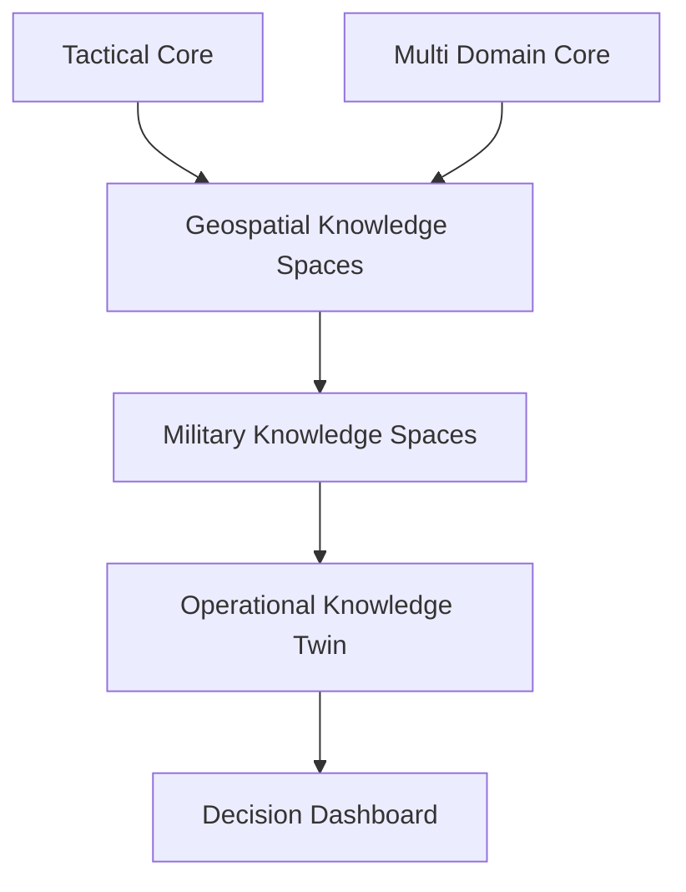

# Software Defined Defense

A capability-driven reference architecture for future defense ecosystems.

Software Defined Defense shifts military advantage from hardware-centric systems toward software, data, geospatial knowledge, and human-centered artificial intelligence.

## Pillars

- Software Defined Defense
- Military Knowledge Spaces
- Geospatial Knowledge Spaces
- Urban Geospatial Intelligence
- Operational Knowledge Twins
- Digital Battlespaces

## Demonstrations

### Tactical Core Integration

A reference implementation integrating Tactical Core services into a geospatial knowledge architecture.

### Battle Simulation

A simulated operational environment demonstrating:

- unit movement
- engagements
- mission execution
- situation awareness

### Urban Intelligence

An Urban GEOINT demonstration combining:

- IPB
- HUMINT
- OSINT
- Population Intelligence
- Threat Profiling

## Reference Architecture

## Documentation

### Concepts

- [Software Defined Defense](concepts/software-defined-defense.md)
- [Military Knowledge Spaces](concepts/military-knowledge-spaces.md)
- [Geospatial Knowledge Spaces](concepts/geospatial-knowledge-spaces.md)
- [Urban Geospatial Intelligence](concepts/urban-geospatial-intelligence.md)
- [Operational Knowledge Twins](concepts/operational-knowledge-twins.md)
- [Digital Battlespaces](concepts/digital-battlespaces.md)

### Architecture

- [Tactical Core Integration](architecture/tactical-core.md)
- [Multi Domain Core](architecture/multi-domain-core.md)

### Scenarios

- [Ukraine Battle Simulation](scenarios/ukraine-battlesim.md)
- [Urban IPB](scenarios/urban-ipb.md)

``