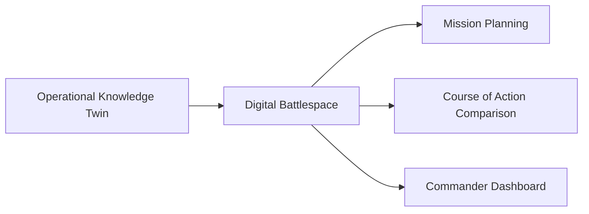

# Digital Battlespaces

## Definition

A Digital Battlespace is the decision environment where Operational Knowledge Twins are visualized, explored, and acted upon by human decision-makers.

It is the point where geospatial knowledge becomes operational decision support.

---

## Purpose

The Digital Battlespace does not generate new data. It presents the current operational understanding in a form that supports:

- Mission planning
- Course-of-action comparison
- Cross-domain situational awareness
- Coalition and multi-echelon collaboration

---

## Core Capabilities

### Multi-Domain Visualization

Presents land, air, maritime, cyber, and space context within a single spatial reference.

### Course-of-Action Comparison

Displays alternative courses of action generated from the Operational Knowledge Twin side by side.

### Time-Based Analysis

Shows how the operational picture evolved and how it may develop.

### Collaborative Decision Space

Supports shared awareness across command levels and partner forces.

---

## Architecture

---

## Human Decision Point

The Digital Battlespace is a decision support environment, not a decision-making system. All courses of action, plans, and orders remain under human authority.
