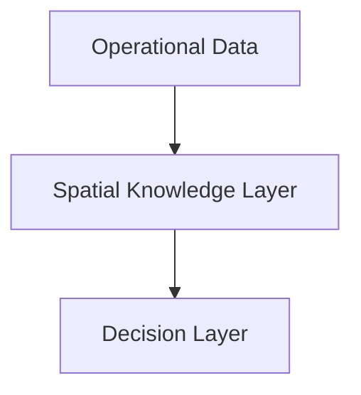

# Geospatial Knowledge Spaces

## Why Geospatial?

Every mission has:

- a location
- a time
- a context

Geography provides the common reference framework that connects all domains.

---

## Purpose

Geospatial Knowledge Spaces provide:

- Context
- Meaning
- Trust
- Decision Support

on top of Tactical Core and Multi-Domain Core architectures.

---

## Architecture

---

## Knowledge Objects

Examples:

- Infrastructure
- Sensor Observations
- Mission Objectives
- Threat Activity
- Operational Plans
- Population Information

---

## Outcomes

- Explainable decisions
- Faster understanding
- Improved interoperability
- Shared operational context