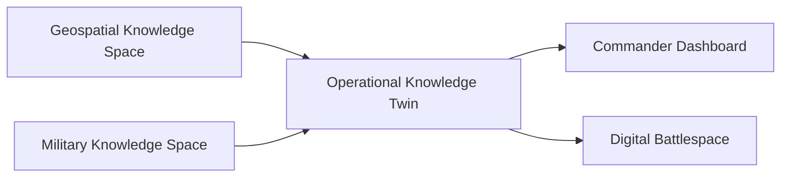

# Operational Knowledge Twins

## Definition

An Operational Knowledge Twin is a continuously updated representation of the operational environment, built from the Geospatial and Military Knowledge Spaces.

It is not a static map. It is a living model of what is known, how confident that knowledge is, and how it is changing over time.

---

## Difference from a Digital Twin

A conventional digital twin mirrors a physical asset or system.

An Operational Knowledge Twin mirrors the **state of understanding** of an operational environment, including:

- Confidence and trust levels
- Competing hypotheses
- Temporal change
- Relationships between entities

---

## Core Capabilities

### Continuous Synchronization

Ingests updates from Tactical Core, Multi Domain Core, and Knowledge Spaces in near real time.

### Confidence-Aware State

Every element carries a trust and confidence level rather than being presented as absolute fact.

### Scenario Projection

Supports course-of-action modeling and forecasting based on current knowledge state.

### Shared Reference

Provides a common operational reference for multiple echelons and coalition partners.

---

## Architecture

---

## Human Decision Point

The Operational Knowledge Twin presents the current state of knowledge and its confidence. Commanders and analysts interpret and decide. The twin never issues decisions or orders.
