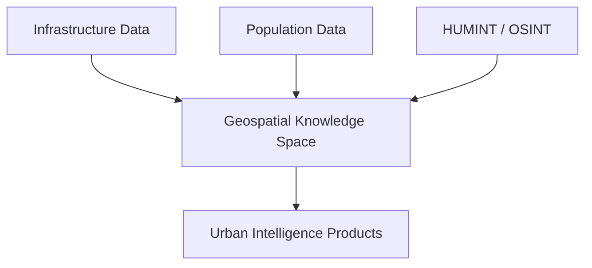

# Urban Geospatial Intelligence

## Definition

Urban Geospatial Intelligence applies the Geospatial Knowledge Space to dense, complex urban terrain, where infrastructure, population, and threat actors are tightly interwoven.

---

## Why Urban Terrain Is Different

Urban environments introduce:

- Vertical complexity (subterranean, ground level, elevated)
- Dense infrastructure dependencies
- Mixed civilian and military presence
- Rapid change in pattern of life

Standard terrain analysis is insufficient without population and infrastructure context.

---

## Core Capabilities

### Infrastructure Modeling

Represent buildings, utilities, transportation, and critical infrastructure as connected knowledge objects.

### Population Intelligence

Understand population distribution, movement patterns, and vulnerability without reducing individuals to surveillance targets.

### Multi-Source Fusion

Combine IPB, HUMINT, OSINT, and sensor data into a shared urban knowledge base.

### Threat Profiling

Identify likely threat activity zones based on historical patterns and current indicators.

---

## Architecture

---

## Outcomes

- Threat zones and vulnerability maps
- Route and mobility assessments
- Explainable population-context awareness
- Decision support for urban operations

---

## Human Decision Point

Urban Geospatial Intelligence informs commanders and analysts. It does not automate targeting or population-level decisions. Human judgment remains authoritative.
